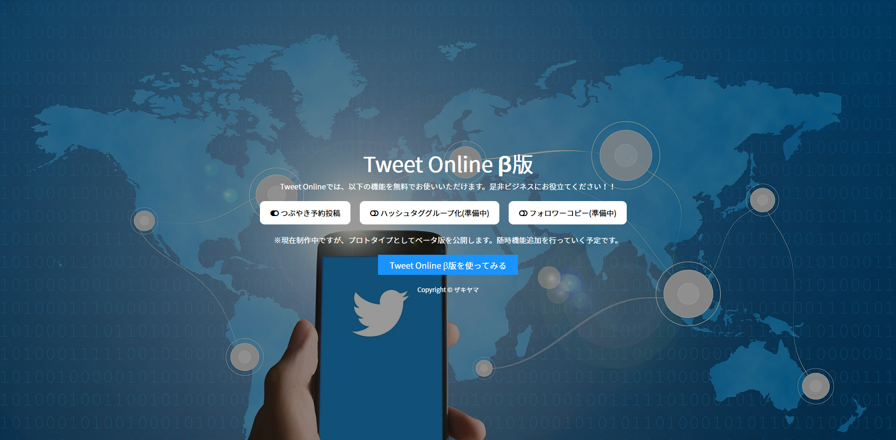
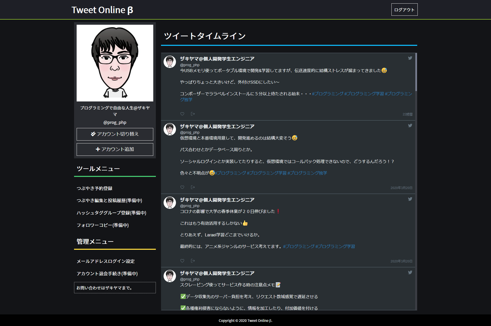
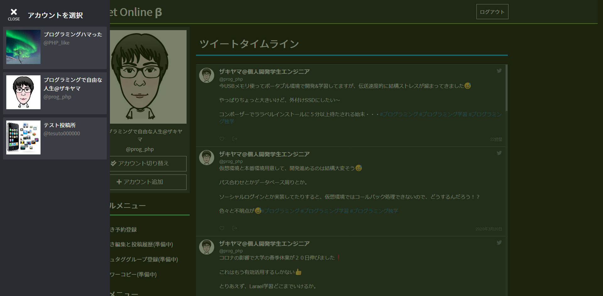
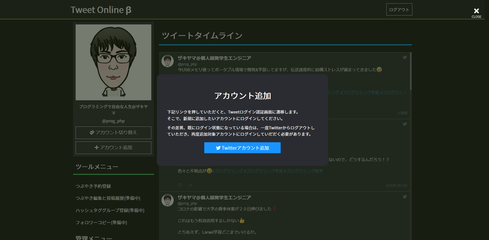
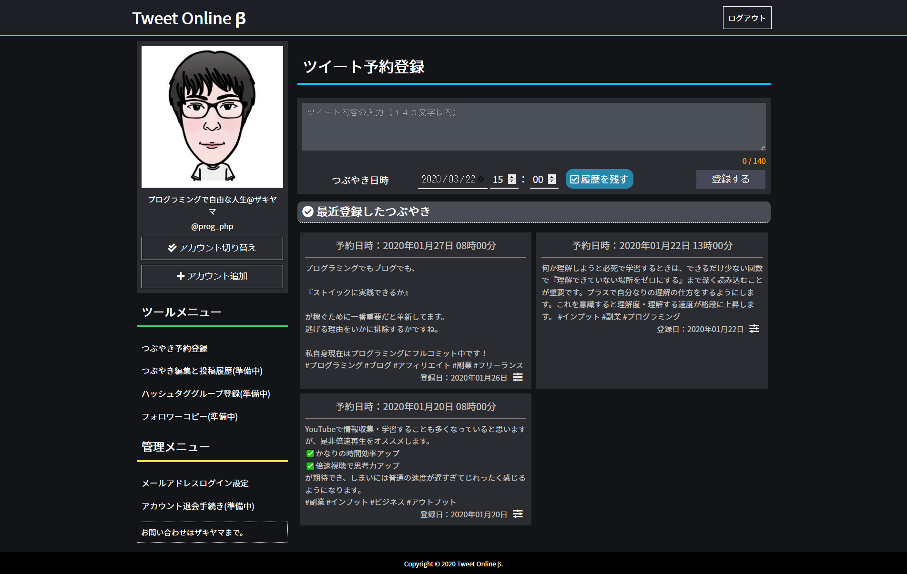

# Tweet Online

開発自体を中止したので、コードを公開することにしました。

元々は、有料のTwitter運用ツールを利用していたのですが、無料のサービスとして使いたいという願望があり、制作をスタートしたものになります。しかし、サービスとしてリリースするにあたり、色々と問題が浮上したため、サービスとしての公開は中止することにしました。

<ul>主な機能
  <li>ツイート予約機能</li>
  <li>
    ハッシュタググループ化 
    ツイートにハッシュタグを挿入するときに、いつも使うハッシュタグをリストから選んで、一括で挿入できる機能です。
  </li>
  <li>
    フォロワーコピー 
    自分と属性の近いインフルエンザーアカウントを指定し、そのインフルエンザーのフォロワーに対して、アクションを起こす機能です。
  </li>
</ul>

<strong>以下スクショです。</strong>

サービス紹介ページ

コントロールページ

Twitterアカウントの選択・切り替え

Twitterアカウントの追加

ツイート予約画面

